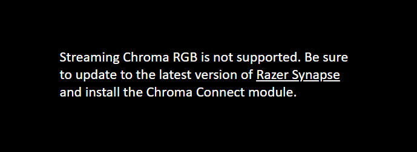
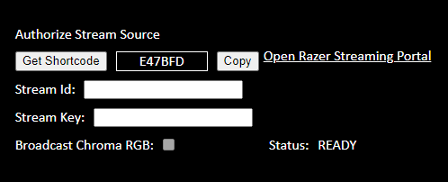
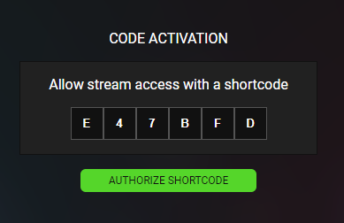
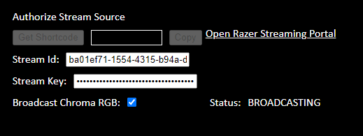

# Latest

* Visit the [Chroma Animation Guide](https://chroma.razer.com/ChromaGuide/) to find the latest supported plugin for Chroma RGB.

# HTML5_ChromaStreamApp

HTML5 Chroma Stream App for Chroma RGB streaming.

---

**Table of Contents**

* [See Also](#see-also)
* [Steps](#steps)
* [Screenshots](#screenshots)

---

<a name="see-also"></a>

## See Also

**Docs:**

* [Chroma Animation Guide](http://chroma.razer.com/ChromaGuide/) - Visual examples of the Chroma Animation API methods

**Plugins:**

* [CChromaEditor](https://github.com/RazerOfficial/CChromaEditor) - C++ library for playing and editing Chroma animations

**Notes**

* For more information about streaming Chroma RGB check out the [streaming section](https://github.com/razerofficial/CChromaEditor#streaming) of the C++ plugin.

---

<a name="steps"></a>

## Steps

Step 1. Check for streaming support

```
 function connectStreamSocket() {
  if (streamSocket == undefined) {
   streamSocket = new WebSocket("wss://chromasdk.io:13340/razer/stream");
   streamSocket.onopen = function (event) {
    // supported
   };
   streamSocket.onclose = function (event) {
    // not supported
   };
   streamSocket.onerror = function (error) {
    // not supported
   };
  }
 }
```

Step 2. Get and copy the shortcode

```
// send
let sendJson = {
  "method": "ChromaSDKStreamGetAuthShortcode",
  "platform": "PC",
  "title": "HTML5 Chroma Stream App"
};
streamSocket.send(JSON.stringify(sendJson));

// receive
case 'ChromaSDKStreamGetAuthShortcode':
  if (json.shortcode && json.shortcode.length > 0) {
    timerRequest = Date.now() + (1000 * 60 * 5); // +5 minutes
    txtShortcode.innerText = json.shortcode;
  }
```

Step 3. Check for stream id authorization every 1 second

```
// send
let sendJson = {
  "method": "ChromaSDKStreamGetId",
  "shortcode": txtShortcode.innerText
};
streamSocket.send(JSON.stringify(sendJson));

// receive
case 'ChromaSDKStreamGetId':
  if (streamStatus == 'READY' && json.result == 'SUCCESS') {
    if (json.stream_id && json.stream_id) {
      txtStreamId.value = json.stream_id;
    }
  }
```

Step 4. Check for stream key authorization every 1 second

```
// send
sendJson = {
  "method": "ChromaSDKStreamGetKey",
  "shortcode": txtShortcode.innerText
};
streamSocket.send(JSON.stringify(sendJson));

// receive
case 'ChromaSDKStreamGetKey':
  if (streamStatus == 'READY' && json.result == 'SUCCESS') {
    if (json.stream_key && json.stream_key) {
      txtStreamKey.value = json.stream_key;
    }
  }
```

Step 5. Release the shortcode after authorization is complete

```
// send
if (txtStreamId.value.length > 0 && txtStreamKey.value.length > 0) {

  let sendJson = {
    "method": "ChromaSDKStreamReleaseShortcode",
    "shortcode": txtShortcode.innerText
  };
  streamSocket.send(JSON.stringify(sendJson));

// receive
case 'ChromaSDKStreamReleaseShortcode':
  txtShortcode.innerText = '';
  timerRequest = Date.now();
  break;
```

Step 6. Broadcast to stream Chroma RGB

```
let sendJson = {
  "method": "ChromaSDKStreamBroadcast",
  "stream_id": txtStreamId.value,
  "stream_key": txtStreamKey.value,
  "timestamp": 0
};
streamSocket.send(JSON.stringify(sendJson));
```

Step 7. End the broadcast

```
sendJson = {
  "method": "ChromaSDKStreamBroadcastEnd"
};
streamSocket.send(JSON.stringify(sendJson));
```

---

<a name="screenshots"></a>

### Screenshots

* **Synapse 3 and the Chroma Connect Module are required**



* **Use the shortcode to authorize a stream source**



* **Authorize the shortcode on the [Razer Streaming Portal](https://stream.razer.com/)**



* **Broadcast to the authorized stream**


